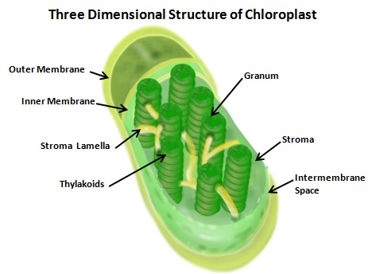

### Theory
 
Chloroplasts are organelles 5-10 um in size in plants which perform the function of photosynthesis.  These structures are mainly located in the palisade parenchyma of the mesophyll cells in the leaf. Chloroplasts belong to a family of specialized organelle called the plastid. The stem, leaves and unripened fruit  in all the plants contain chloroplast. But leaves are major part of plants performing the process of photosynthesis. The green color of these structures in plants is due to the presence of a pigment called chlorophyll which resides in the chloroplasts. 
 
Chloroplasts like mitochondria are evolved by endosymbiosis. Both chloroplasts and mitochondria are involved in generating metabolic energy. Both organelles have their own genetic systems. During photosynthesis, the conversion of light energy derived from sunlight is converted into chemical energy in the form of carbohydrates and during this process ATPs are generated.  In spite of having their own genetic system, most of the chloroplast proteins are encoded by the cell’s nuclear DNA. These proteins are synthesized in the ribosomes of the cytosol and are then imported to the organelle. Approximately 30 proteins are encoded by the chloroplast genome and some of these proteins are involved in photosynthesis.
 
### Structure of Chloroplast
 
Chloroplasts are found in the mesophyll cells of the leaves. The chloroplast is divided into three compartments bounded by three membrane systems: an intermembrane space between the inner and outer membranes, the stroma and the thylakoid lumen.  Chloroplasts have a double membrane structure called the chloroplast envelop.  The chloroplast envelop has an inner membrane and an outer membrane. A third membrane system called  the thylakoid membrane  surrounds the thylakoids in the stroma.  

 

Chloroplasts are located inside the thylakoid membranes.  Thylakoid membrane consists of the thylakoids which are flattened discs arranged on top of the other and they are termed as grana.  The thylakoids are located inside the stroma. Photosynthesis takes place in the thylakoid membranes.The chlorophyll molecules absorb light in the form of photons and this leads to the emission of electrons by the chlorophyll molecules. This drives the hydrogen ions across the membrane surrounding the thylakoid stack. This leads to the formation of an electrochemical gradient which drives the production of ATP. 
 

 
### Isolation of Chloroplast
 
In chloroplast isolation method, the cell wall is broken mechanically using a blender or homogenizer. Then the unbroken leaf tissue and the cellular debris are removed by filtration. The chloroplasts are collected by centrifugation using a percoll gradient. Leaves of spinach, lettuce are commonly used for the isolation of chloroplasts. Both intact and broken chloroplasts are formed  after centrifugation. The broken chloroplasts are removed and the intact chloroplasts are taken for further studies. Intact chloroplasts are the best source for studying the processes like carbon assimilation, electron flow and phosphorylation.  The concentration of the chlorophyll molecules can be estimated from the isolated chloroplasts. DNA and RNA of chloroplasts can also be extracted.
